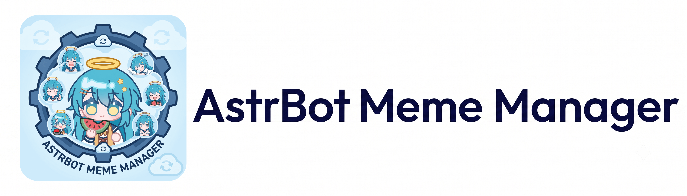
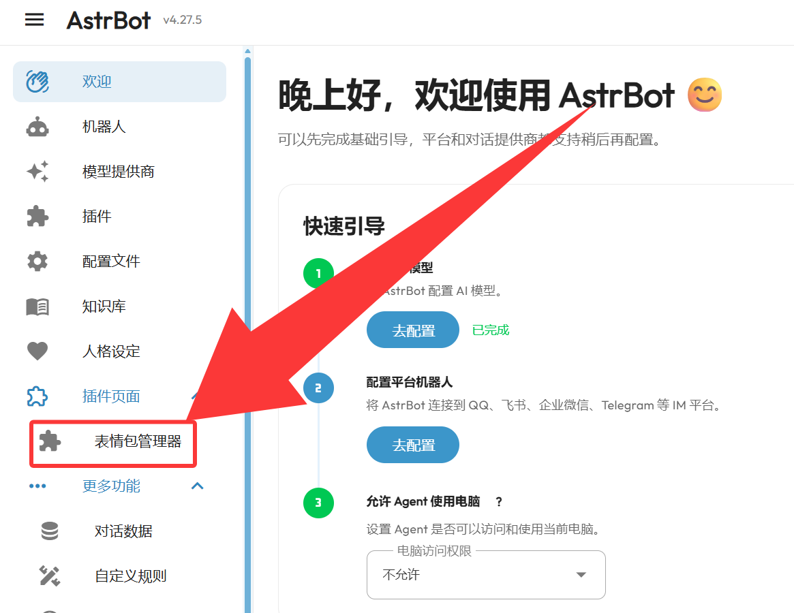
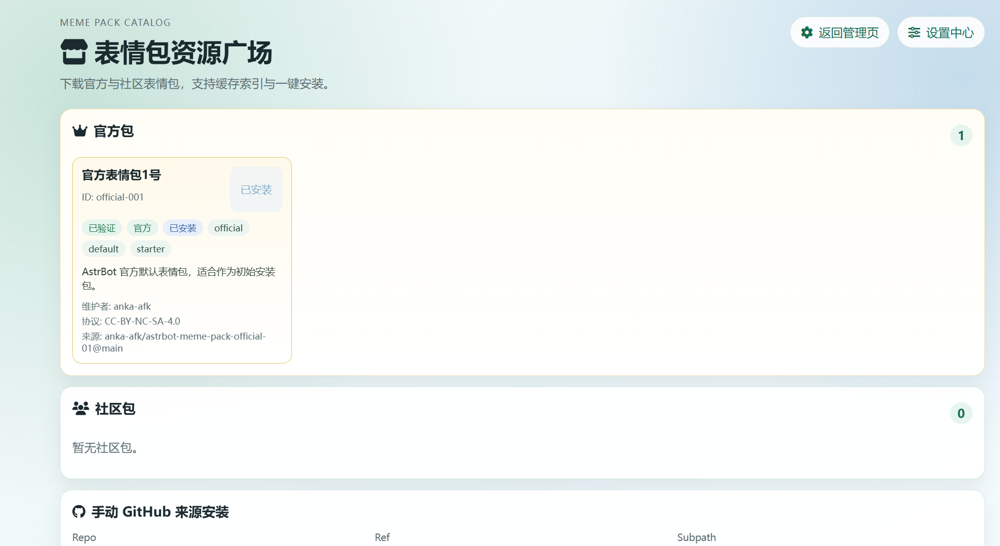
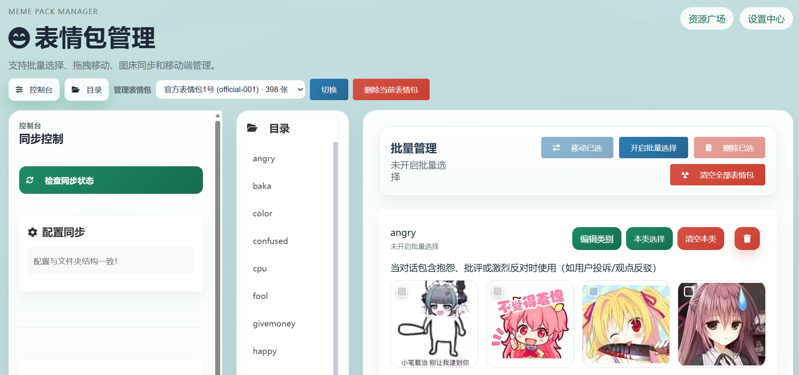
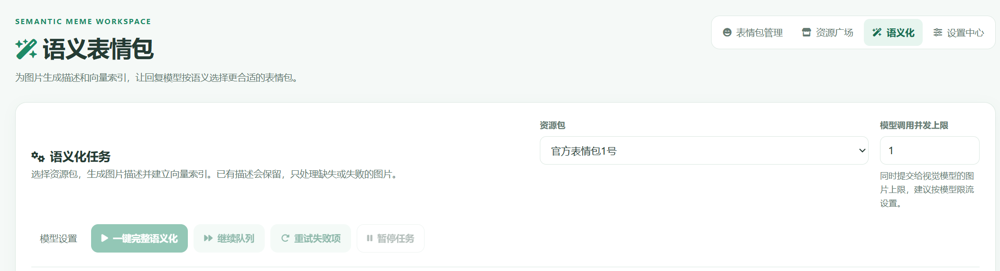
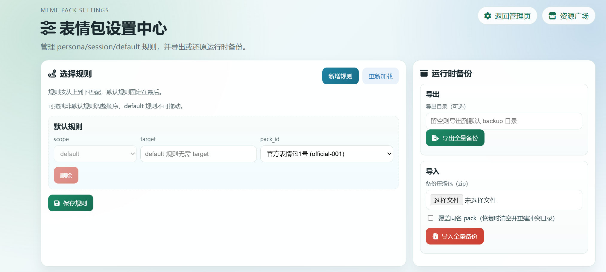

# 🌟 AstrBot 表情包管理器

一个功能强大的 AstrBot 表情包管理插件，支持 🤖 AI 智能发送与自动收集表情、🖥️ WebUI 管理界面、☁️ 云端同步等特性。

## 📑 目录

- [📢 通知](#-通知)
- [🛠️ 第一次使用](#️-第一次使用)
- [❓ 常见问题](#-常见问题)
- [📚 协议与创作指引](#-协议与创作指引)
- [🖥️ WebUI 管理界面](#️-webui-管理界面)
- [🤖 自动收集表情包](#-自动收集表情包)
- [⚠️ 兼容性](#️-兼容性)
- [📝 使用指令](#-使用指令)
- [📜 更新日志](#-更新日志)
- [🛠️ 问题反馈](#️-问题反馈)
- [📄 许可证](#-许可证)

## 📢 通知

**v5.0.1 提供新版提示词，请按需重置默认模板。** 升级并重载插件后，进入 **设置中心 → 提示词模板 → 恢复默认模板 → 保存并应用**，载入新版前缀、后缀及附加模板。已有自定义内容请先复制备份，再按需合并回新版模板。

## 🛠️ 第一次使用

1. 安装插件后，进入 AstrBot WebUI → 插件页面 → **表情包管理器**。
2. 打开**资源广场**，下载一个官方或社区表情包；也可以使用 `/表情管理 恢复默认表情包` 安装官方包。
3. 进入**设置中心 → 使用规则**，将下载的包设为默认，或绑定到指定会话、人格，然后保存规则。
4. 开始聊天。插件会自动提供当前表情包的分类提示，无需修改人格；有合适的表情时，模型可以配合文字发送，也可以只发表情。

首次使用没有内置图片，需要先安装表情包。管理页的选包用于浏览和编辑，聊天实际使用哪个包由使用规则决定。

## ❓ 常见问题

**必须配置图床吗？** 不需要。图床用于云端同步，本地管理与表情发送可独立使用。

**下载了新包，为什么聊天还用原来的？** 请在设置中心保存使用规则。下载或切换管理页的表情包，不会自动修改聊天选包规则。

**可以流式回复吗？** 可以。经过 AstrBot 流式消息管线的标签会在发送前解析，有歧义的片段会暂时缓冲，图片在回复结束后发送。

**必须进行语义化吗？** 不需要。普通分类模式即可使用；希望按图片描述检索时，再配置语义化。

## 📚 协议与创作指引

### 协议文档

- 协议文档见 [anka-afk/astrbot-meme-pack-index](https://github.com/anka-afk/astrbot-meme-pack-index)

### 如何创建并分享自己的表情包（Issue / PR）

1. 前往索引仓库 README 阅读完整提交指引：
   [anka-afk/astrbot-meme-pack-index](https://github.com/anka-afk/astrbot-meme-pack-index)
2. 按协议准备你的表情包仓库结构（manifest、memes、previews），并确保仓库可访问。
3. 如果你会编辑索引文件：
   - 直接在索引仓库提交 PR
4. 如果你不会编辑索引文件：
   - 在索引仓库提 Issue，按模板填写信息
5. 你也可以先参考示例仓库模板：
   [anka-afk/astrbot-meme-pack-example](https://github.com/anka-afk/astrbot-meme-pack-example)

> 建议：先在本地或测试环境通过“资源广场安装”验证一次，确保索引条目可安装、可预览、分类描述清晰。

## 🖥️ WebUI 管理界面

### 资源广场

浏览和安装官方、社区表情包，也支持通过 GitHub 仓库地址安装索引之外的表情包。

### 表情包管理

按分类预览图片，上传、删除、拖拽移动或批量整理表情，编辑分类描述，并切换不同表情包进行管理。

### 语义表情包

普通模式按分类选择表情；语义模式会先为图片生成描述和检索向量，再根据对话寻找更贴切的图片。使用前需在设置中心配置图片描述模型与向量模型，并在“语义化”页面完成处理。生成描述和向量会调用对应模型，费用取决于所用服务。

语义化页面可以查看处理进度、继续任务和重试失败图片。自动收集的图片统一在表情包管理页审核接收后，再按需生成语义索引。

### 设置中心

设置按用途分类：**使用规则、表情发送、语义与模型、自动收集、存储与下载、提示词模板、标签与匹配、导入与备份**。可搜索配置名称，修改参数后点击“保存并应用”；使用规则单独保存。

## 🤖 自动收集表情包

在**设置中心 → 自动收集**开启，并选择支持图片输入的视觉模型。插件会识别收到的图片，从目标表情包的现有分类中选择合适的分类，并进行去重。

自动收集默认关闭，识图需要调用视觉模型；

1. 进入**表情包管理**，切换到收集目标包。
2. 有待审核图片时，选包框右侧显示**待审核表情**按钮，点击查看图片、建议分类和两项置信度。
3. 默认按分类置信度从高到低排列，低把握度排在后面；可筛选分类、调整排序和修改接收分类，然后接收选中的图片。
4. 不需要的图片可以丢弃；勾选“不再收集”后，相同内容不会再次进入该包的候选列表。

关闭人工审核后，新收集的图片自动入包，已有待审核图片仍需处理。**无论审核开关是否开启，语义索引都由用户手动生成**。符合当前语义描述标准且接收分类未改变的收集结果可直接复用描述。

## ⚠️ 兼容性

其他插件自行请求模型或发送消息时，可通过本插件的公开接口接入表情处理。接口说明与示例见 [开发指南 → 插件联动接口](DEVELOPMENT.md#插件联动接口)，流式处理方式与边界见 [解析与消息发送](DEVELOPMENT.md#解析与消息发送)。

## 📝 使用指令

当前大部分功能都可以通过 AstrBot WebUI 管理界面操作，无需使用指令。以下为指令列表，供 CLI 用户参考：

| 指令                                   | 描述                                                |
| -------------------------------------- | --------------------------------------------------- |
| `/表情管理 查看图库`                   | 📚 列出所有可用表情类别                             |
| `/表情管理 添加分类 [类别名称] [描述]` | ➕ 创建新的表情包分类，可只输入名称后按提示补充描述 |
| `/表情管理 添加表情 [类别]`            | ➕ 通过聊天上传表情到指定类别                       |
| `/表情管理 恢复默认表情包`             | ♻️ 从官方仓库一键安装首个官方表情包并设为默认       |
| `/表情管理 清空指定类型 [类别]`        | ⚠️ 清空指定类别中的表情包，保留类型本身             |
| `/表情管理 清空全部`                   | ⚠️ 清空全部表情包，保留所有类型和描述配置           |
| `/表情管理 删除类型本身 [类别]`        | ⚠️ 删除指定类型及其描述配置                         |
| `/表情管理 同步状态`                   | 🔄 检查同步状态                                     |
| `/表情管理 同步到云端`                 | ☁️ 将本地表情同步到云端                             |
| `/表情管理 从云端同步`                 | ⬇️ 从云端同步表情到本地                             |
| `/表情管理 覆盖到云端`                 | ⚠️ 让云端与本地完全一致                             |
| `/表情管理 从云端覆盖`                 | ⚠️ 让本地与云端完全一致                             |

## 📜 更新日志

当前版本：v5.0.4

- 🤖 **自动收集审核**：默认先进入待审核列表，支持分类筛选、按把握度排序、修改分类及批量接收或丢弃。
- 🖼️ **相似图片预览**：悬停“已有疑似相似图片”即可对照已有图片，点击可固定预览。
- ⚙️ **容量与去重**：每包待审核容量可配置，默认 200 张；优化去重和图片保存，减少重复处理。
- 🧠 **识图结果复用**：符合条件的描述可直接复用；关闭人工审核后新图片自动入包，语义索引仍需手动生成。
- 🛠️ **回复修复**：空表情包不再注入选图提示，增加发送前的残留表情标签过滤。

完整版本记录请查看 [CHANGELOG.md](CHANGELOG.md)。

## 🛠️ 问题反馈

如果遇到问题或有功能建议，欢迎在 GitHub 提交 Issue。

## 📄 许可证

本项目基于 MIT 许可证开源。
